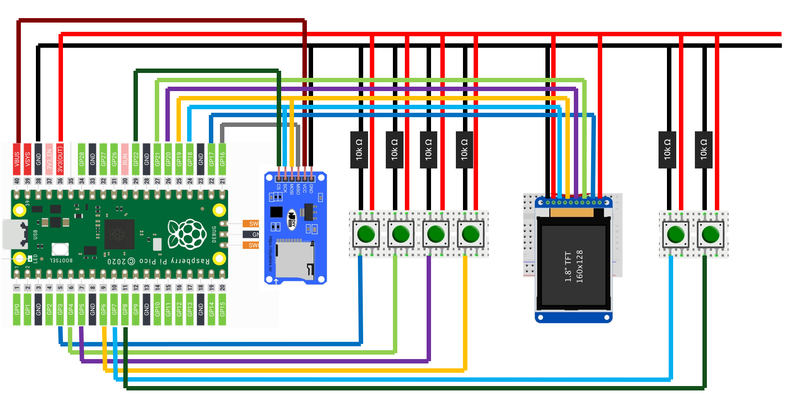

# Pi Game Engine by Julez

A lightweight game engine for the **Raspberry Pi Pico W**, built from scratch. This project demonstrates an Entity-Component-System (ECS) architecture with events, physics, and dynamic collision detection, along with sample games.


## Features

Entity-Component-System (ECS): Modular design to separate data, behavior, and logic.
Event system: Easily handle game events, collisions, and input.
Physics & Collision Detection: Dynamic collisions, basic physics simulation.
Sprite Rendering, Animations, Tileset Rendering from SD Card Module.


## Sample games included:

Pong: Classic game to play against the computer.
Jump & Run (WIP): Early prototype for a platformer demo.
Exploration: Demo for Tileset, Sprites and Animation Rendering.


## Libraries used:
- no-OS-FatFS-SD-SDIO-SPI-RPi-Pico


## Quick build

Run this inside the root folder
```bash
mkdir -p build && cd build && cmake -G "Ninja" .. && ninja
```

or this inside the empty build folder
```bash
cmake -G "Ninja" .. && ninja
```


## Hardware I used
- Raspberry Pi Pico W
- ST7735 LCD Display
    - CS: pin 17
    - SCK: pin 18
    - MOSI: pin 19
    - RST: pin 20
    - DC: pin 21
- SD Card Module
    - CS: pin 22
    - SCK: pin 18
    - MOSI: pin 19
    - MISO: pin 16
- 6x6x5 mm Miniature Push Button
    - UP: pin 3
    - DOWN: pin 4
    - LEFT: pin 5
    - RIGHT pin 6
    - A: pin 7
    - B: pin 8


## Wiring scheme

